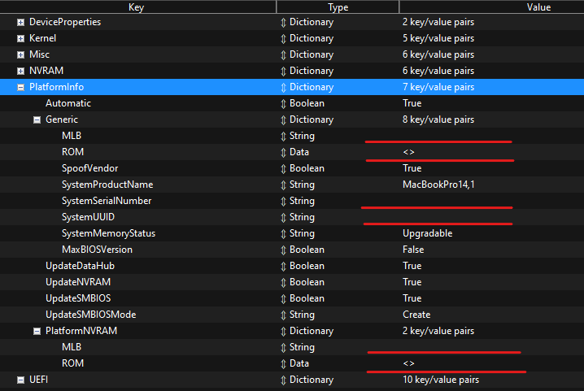

# Lenovo ThinkPad T480s - OpenCore Config
(Almost) Fully working configuration to run MacOS on the Thinkpad T480s

   <strong>Status: Maintained</strong>
    
   <strong>Version: </strong>2.0
    
   <a href="https://github.com/expo1337/Thinkpad-T480s-Hackintosh/releases"><strong>Download now »</strong></a>
    
   <a href="https://github.com/expo1337/Thinkpad-T480s-Hackintosh/issues">Report a Bug</a>
  

 

# 📝 Basic information
* Supported Mac OS versions : Ventura, Monterey, Big Sur, Catalina (tweaks needed, swap out the airportlwm kext)
* Laptop runs very good but the power managment doesn't seem efficent enough (sometimes running too hot, high power usage.)
* SMBIOS: MacBookPro14,1 || MacBookPro15,2
* OpenCore Version : 0.8.7

# ⚙️ Configuration
* The EFI is almost ready to go, you'll just need to generate unique SMBIOS for your device using [GenSMBIOS](https://github.com/corpnewt/GenSMBIOS)
* Fields you'll need to modify 

# ⭐️ Warning 
* I'm not an expert in hackintoshing, if you have any questions feel free to use the discussions tab or contact me on discord.
* Feel free to make this EFI better by contributing!  

# 💻 My Hardware

These are the Hardware components I use. But this OpenCore configuation <strong>should</strong> still work with your device, even if the components are not exactly same.

| Category  | Component                            |
| --------- | ------------------------------------ |
| CPU       | Intel Core i7-8550U                  |
| GPU       | Intel UHD Graphics 620               |
| SSD       | Samsung EVO 970 Pro                  |   
| Memory    | 16+8GB DDR4 2400Mhz                  |
| Display   | 14.0" FHD 1920x1080 LED IPS          |
| Ethernet  | Intel Ethernet I219-V                |
| WiFi & BT | Intel Dual-Band Wireless AC-8265     |

# ⚙️ Kexts used
* [Airportlwm](https://github.com/OpenIntelWireless/itlwm/releases) => Enable Intel wifi
* [AppleALC](https://github.com/acidanthera/AppleALC/releases) => Sound related config
* [BlueToolFixup](https://github.com/acidanthera/BrcmPatchRAM/releases) => Enable Intel Bluetooth
* [CpuFriend](https://github.com/acidanthera/CPUFriend/releases) => Power managment
* [IntelMausi](https://github.com/acidanthera/IntelMausi/releases) => Enable Intel Ethernet
* [Lilu](https://github.com/acidanthera/Lilu/releases) => A kext to patch many processes
* [NVMeFix](https://github.com/acidanthera/NVMeFix/releases) => Fix unsupported NVMe drives
* [VirtualSMC](https://github.com/acidanthera/VirtualSMC/releases) => Emulates the SMC chip found on real macs
* [WhateverGreen](https://github.com/acidanthera/WhateverGreen/releases) => Used for GPU patching
* [USBMap](https://github.com/USBToolBox/kext) => Fix USB mapping
* [VoodooPS2Controller](https://github.com/acidanthera/VoodooPS2/releases) => Fix Touchpad

